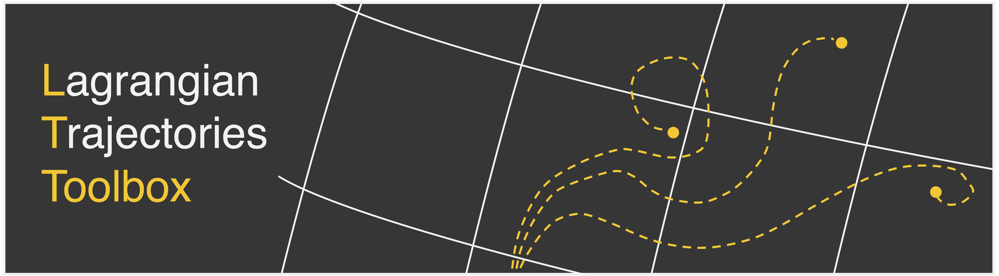
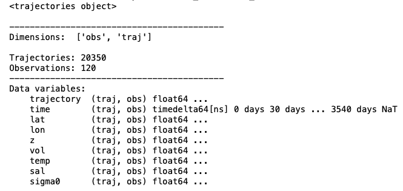
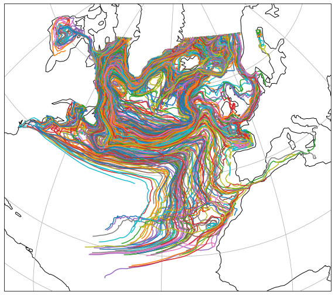
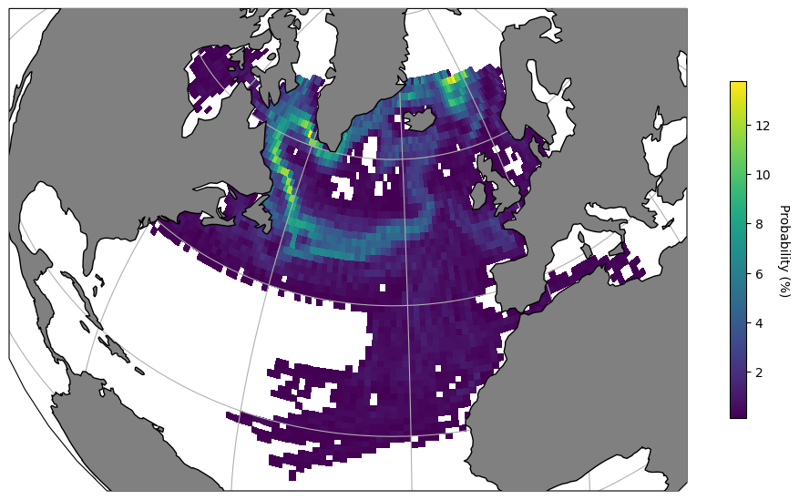

<br />
<p align="center">
    
  </a>

  <h3 align="center">Lagrangian Trajectories Toolbox</h3>

  <p align="center">
    Post-Processing, Visualisation & Analysis of Lagrangian trajectories
    </a>
    <br />
    <br />
    ·
    <a href="https://oj-tooth.github.io/lt_toolbox/index.html"><strong>Explore the docs</strong></a>
    ·
    <a href="https://github.com/oj-tooth/lt-toolbox/issues"><strong>Report an issue</strong></a>
    ·
  </p>
</p>

<!-- Table of Contents -->
### Table of Contents

* [About the LT Toolbox](#about-the-lt-toolbox)
  * [Background](#background)
* [Getting Started](#getting-started)
  * [Prerequisites](#prerequisites)
  * [Installation](#installation)
* [Usage](#usage)
  * [Example](#example)
* [License](#license)
* [Contact](#contact)
* [Acknowledgements](#acknowledgements)

<!-- About the LT Toolbox -->
## About The Lagrangian Trajectories Toolbox

The Lagrangian Trajectories Toolbox is a Python library dedicated to the post-processing, visualisation and analysis of Lagrangian particle trajectories. 

The toolbox offers users two data structures to work with Lagrangian particle trajectories: Trajectory Arrays (TrajArrays) and Trajectory Frames (TrajFrames).
TrajArrays utilise [xarray](http://xarray.pydata.org/en/stable/#) multidimensional data arrays to store attribute variables (e.g. lat, lon, temperature etc.) evaluated along trajectories. Meanwhile, TrajFrames make use of the blazingly fast [polars](https://pola-rs.github.io/polars-book/user-guide/index.html) DataFrame library to store attribute variables in a tabular format. The choice of whether to use a TrajArray of TrajFrame in your analysis is often determined by the Lagrangian trajectory code used to evaluate your particle trajectories in the first place. For example, TrajArrays are best suited for working with .zarr files output from [OceanParcels](https://oceanparcels.org), whereas TrajFrames are well suited for working with large .csv files generated from [TRACMASS](https://www.tracmass.org).

Beyond simply storing Lagrangian data, TrajArrays and TrajFrames contain a wide range of built-in methods to enable the efficient post-processing and visualisation of particle trajectories with [plotly](https://plotly.com/python-api-reference/index.html), [matplotlib](https://matplotlib.org) and [Cartopy](https://scitools.org.uk/cartopy/docs/latest/).

#### The LT Toolbox is under active development - current features include:

+ **Store** the attribute variables of Lagrangian trajectories in a TrajArray or TrajFrame object.

+ **Add** new variables, such as transit times and seeding levels, to your TrajArray or TrajFrame.

+ **Filter** trajectories using any attribute variable contained in your TrajArray or TrajFrame.

+ **Get** existing features, including trajectory start/end times, start/end locations and durations.

+ **Compute** metrics, such as distance travelled, binned-statistics and Lagrangian probabilities from trajectories.

+ **Plot** trajectories, properties and probability distributions in the form of maps, time series, temperature-salinity diagrams and more.

### Background

At the centre of the LT Toolbox are the TrajArray & TrajFrame objects. At their simplest, TrajArrays and TrajFrames represent containers for xarray DataSets and polars DataFrames respectively. This means that users always have complete access to their original trajectory data and also all of xarray's and polar's existing functionality.

By looking at an example TrajArray (Fig. 1), we can see that our original DataSet must be 2-dimensional with dimensions traj (trajectory - representing one particle / float) and obs (observation - representing one time-level). This formatting follows the [NCEI template](https://www.nodc.noaa.gov/data/formats/netcdf/v2.0/trajectoryIncomplete.cdl) for trajectory data, in which attribute variables for each particle / float are stored as a function of a series of observations (obs).

<p align="centre">
     
 </a>
<p


For improved functionality, all attribute variables stored inside our DataSet are made accessible with the command:

```sh
traj.{variable}
```
where traj is our trajectories object and {variable} refers to the name of any attribute variable in our original DataSet. 

The greatest value of the trajectories object comes with the use of the built-in functions specifically designed for post-processing, visualisation and analysis of Lagrangain water parcel trajectories. Below offers a great example of how, in only one line, the user can add a new unique ID attribute variable, trajectories according to their IDs and then map them onto the Earth's surface:

```sh
traj.add_id().filter(query='id < 1000', drop=False).map_trajectories()
```

<p align="centre">
     
 </a>
<p

<!-- Getting Started -->
## Getting Started

Below are our simple installation intructions to quickly get started with the LT Toolbox locally.

### Installation

The LT Toolbox is currently under development and is awaiting packaging for formal release. A temporary installation method is provided below.

To install the current development version of the LT Toolbox, users are strongly recommended to create a new virtual environment.

Next, run the following command to install the package into your virtual environment:

```sh 
pip install git+https://github.com/oj-tooth/lt_toolbox.git
```

<!-- Usage -->
## Usage

To learn more about how to use the LT Toolbox in your own projects see our [**tutorials**](https://oj-tooth.github.io/lt_toolbox/tutorials.html).
    
For further details on each of the modules included in the LT Toolbox view our [**API Reference**](https://oj-tooth.github.io/lt_toolbox/reference.html).

## Example

Below we show an example of how we can quickly calculate and plot a Lagrangian probability map from a collection of water parcel trajectories evaluated using a 1 degree ocean general circulation model (ORCA1-N406 simulation):

```sh
# Importing LT Toolbox following pip installation:
import lt_toolbox as ltt

# Define filepath to example ORCA1 output data:
traj_filepath = ".../lt_toolbox/tutorials/data/ORCA1-N406_TRACMASS_example.zarr"

# Open output .zarr store as an eager xarray DataSet:
dataset = xr.open_zarr(traj_filepath, chunks=None)

# Create a TrajArray from our DataSet:
traj = ltt.TrajArray(ds=dataset)

# Creating a map of the binned probability of all water parcel pathways.
traj.map_probability(bin_res=1, prob_type='traj', cmap='viridis')
```

<p align="centre">
     
 </a>
<p


<!-- License -->
## License

Distributed under the MIT License. See LICENSE file for further details. 

<!-- Contact -->
## Contact

The LT Toolbox is developed and maintained by Ollie Tooth at the University of Oxford, UK. If you would like to get in contact about this project, please email oliver.tooth@seh.ox.ac.uk.

<!-- Acknowledgements -->
## Acknowledgements

* Adapted README.md from opensource template: 
https://github.com/othneildrew/Best-README-Template/blob/master/README.md

* LT-Toolbox logo was created with the help of Noam Vogt-Vincent (@nvogtvincent) at the University of Oxford.

* The example ORCA1-N406 Lagrangian trajectories were evaluated using open-source output made available by the [**TRACMASS**](https://www.tracmass.org) project.
