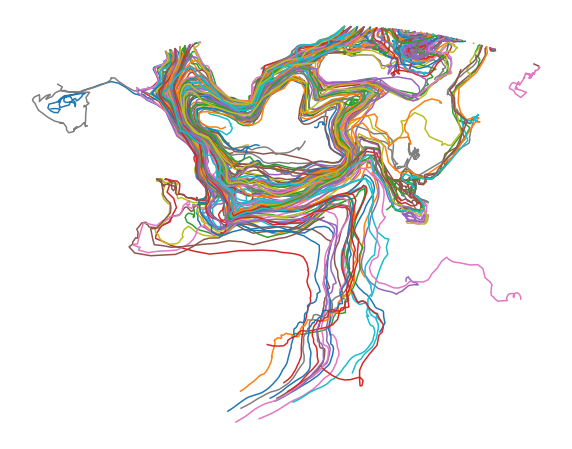

<br />
<p align="center">
    
  </a>

  <h3 align="center">LT Toolbox</h3>

  <p align="center">
    The Lagrangian Trajectories Toolbox
    <br />
    <a href="https://lt_toolbox.readthedocs.io"><strong>Explore the docs »</strong></a>
    <br />
    <br />
    <a href=https://github.com/oj-tooth/lt_toolbox/#example>View Demo</a>
    ·
    <a href="https://github.com/oj-tooth/lt-toolbox/issues">Report Issue</a>
    ·
  </p>
</p>

<!-- Table of Contents -->
## Table of Contents

* [About the LT Toolbox](#about-the-lt-toolbox)
  * [Background](#background)
* [Getting Started](#getting-started)
  * [Prerequisites](#prerequisites)
  * [Installation](#installation)
* [Usage](#usage)
  * [Example](#example)
* [License](#license)
* [Contact](#contact)
* [Acknowledgements](#acknowledgements)

<!-- About the LT Toolbox -->
## About The Lagrangian Trajectories Toolbox

The Lagrangian Trajectories Toolbox is a Python library dedicated to the post-processing, visualisation and analysis of Lagrangian water parcel trajectories. 

The library utilises [xarray](http://xarray.pydata.org/en/stable/#) multidimensional data arrays to store attribute variables (e.g. lat, lon, temperature etc.) evaluated along trajectories in the form of a trajectories object. Beyond simply storing Lagrangian data, the trajectories object contains a wide range of built-in methods to enable efficiently post-process and visualisation of thousands of trajectories with both matplotlib and [Cartopy](https://scitools.org.uk/cartopy/docs/latest/).

#### Current Features:

+ **Store** the attribute variables of Lagrangian trajectories in a trajectories object.

+ **Add** new variables, such as particle IDs and seeding levels, to your object.

+ **Filter** trajectories using any attribute variable contained in your object.

+ **Get** existing features, including trajectory start/end times, start/end locations and durations.

+ **Compute** metrics, such as distance travelled, particle displacements, velocities and Lagrangian probabilities from trajectories.

+ **Plot** trajectory data in the form of time series, temperature-salinity diagrams and more.

+ **Map** trajectories, properties and probability distributions onto the Earth's surface using Cartopy.

### Background

At the centre of the LT Toolbox is the trajectories object. The trajectories object is, at its simplest, a container for an xarray DataSet, allowing the user complete access to the original DataSet and hence all of xarray's existing functionality. By looking at an example trajectories object (Fig. 1), we can see that our original DataSet must be 2-dimensional with dimensions traj (trajectory - representing one particle / float) and obs (observation - representing one time-level). This formatting follows the [NCEI template](https://www.nodc.noaa.gov/data/formats/netcdf/v2.0/trajectoryIncomplete.cdl) for trajectory data, in which attribute variables for each particle / float are stored as a function of a series of observations (obs).


For improved functionality, all attribute variables stored inside our DataSet are made accessible with the command:

```sh
traj.{variable}
```
where traj is our trajectories object and {variable} refers to the name of any attribute variable in our original DataSet. 

The greatest value of the trajectories object comes with the use of the built-in functions specifically designed for post-processing, visualisation and analysis of Lagrangain water parcel trajectories. Below offers a great example of how, in only one line, the user can add an ID attribute variable, filter trajectories according to their distinct ID and map them onto the Earth's surface:

```sh
traj.add_id().filter_between('id', 1, 100).map_trajectories()
```

<p align="center">
     
     
 </a>
<p


<!-- Getting Started -->
## Getting Started

Below are our simple installation intructions to quickly get started with the LT Toolbox locally.

### Installation

The LT Toolbox is currently under development and is awaiting packaging for formal release.

```sh 
```

<!-- Usage -->
## Usage

The LT Toolbox is structured as follows:
    
For further details on each of the modules included in the LT Toolbox view our [docs](https://lt_toolbox.readthedocs.io).

## Example

<!-- License -->
## License

Distributed under the MIT License. See LICENSE file for further details. 

<!-- Acknowledgements -->
## Acknowledgements

* Adapted README.md from opensource template: 
https://github.com/othneildrew/Best-README-Template/blob/master/README.md
